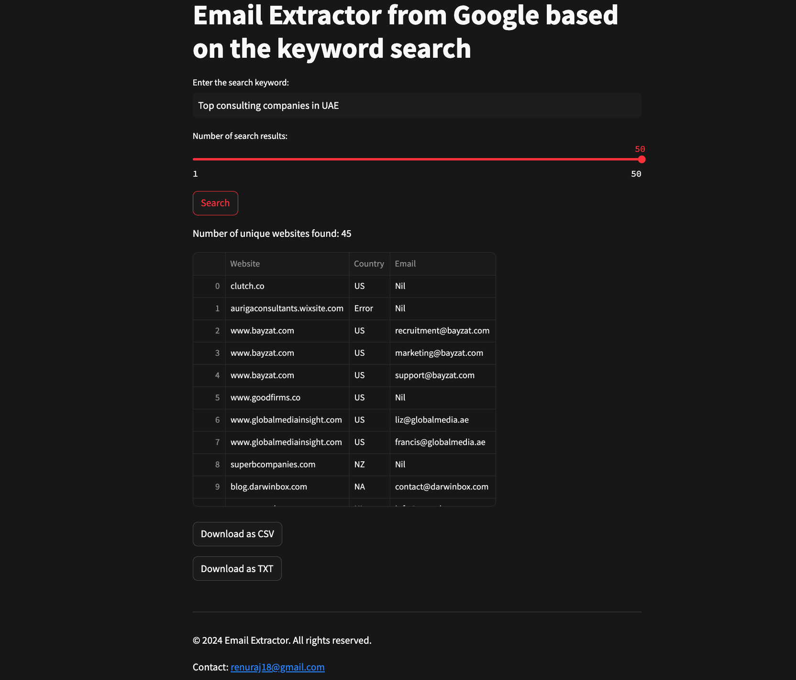

# streamlit-email-extractor

# Website Information Finder

This Streamlit application searches for websites based on a given keyword, finds contact pages, extracts email addresses, and provides the ability to download the information as CSV or TXT files. It also displays the results in a table format with a progress bar to indicate the status of the search process.

## Features

- Input a search keyword to find relevant websites.
- Specify the number of search results to fetch.
- Extracts email addresses from the contact pages of the found websites.
- Displays the results in a table format.
- Provides download options for the results in CSV and TXT formats.
- Progress bar with status message to indicate the search process.

## Requirements

- Python 3.7 or higher
- Streamlit
- Requests
- BeautifulSoup4
- Pandas
- Whois

## Installation

1. Clone this repository:

    ```bash
    git clone https://github.com/your-username/website-information-finder.git
    cd website-information-finder
    ```

2. Install the required packages:

    ```bash
    pip install streamlit requests beautifulsoup4 pandas python-whois
    ```

## Usage

1. Run the Streamlit application:

    ```bash
    streamlit run app.py
    ```

2. Open your web browser and navigate to `http://localhost:8501`.

3. Enter the search keyword and specify the number of search results.

4. Click on the "Search" button to start the search process.

5. View the results in the table format and use the download buttons to save the results as CSV or TXT files.

## File Structure

- `app.py`: The main Streamlit application script.
- `README.md`: This readme file.

## Example



## License

This project is licensed under the MIT License - see the [LICENSE](LICENSE) file for details.

## Contributing

1. Fork the repository.
2. Create a new branch (`git checkout -b feature-branch`).
3. Make your changes.
4. Commit your changes (`git commit -am 'Add new feature'`).
5. Push to the branch (`git push origin feature-branch`).
6. Create a new Pull Request.

## Acknowledgments

- [Streamlit](https://streamlit.io/)
- [Requests](https://docs.python-requests.org/en/master/)
- [BeautifulSoup4](https://www.crummy.com/software/BeautifulSoup/)
- [Pandas](https://pandas.pydata.org/)
- [Python WHOIS](https://pypi.org/project/python-whois/)


# 🎉 Streamlit apps

[![Open in Streamlit][share_badge]][share_link] [![GitHub][github_badge]][github_link]

[share_badge]: https://static.streamlit.io/badges/streamlit_badge_black_white.svg
[share_link]: https://app-email-extractor-46xeatrgbysajy6xtsuoca.streamlit.app/

[github_badge]: https://badgen.net/badge/icon/GitHub?icon=github&color=black&label
[github_link]: https://github.com/renuraj18/streamlit-email-extractor.git
